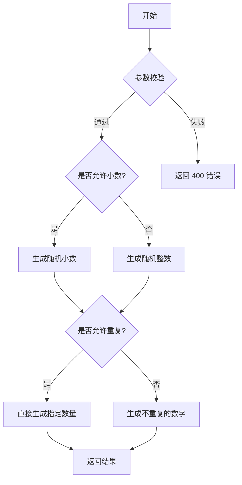

# uapi.MiscApi

All URIs are relative to *https://uapis.cn/api/v1*

Method | HTTP request | Description
------------- | ------------- | -------------
[**get_history_programmer**](MiscApi.md#get_history_programmer) | **GET** /history/programmer | 获取指定日期的程序员历史事件
[**get_history_programmer_today**](MiscApi.md#get_history_programmer_today) | **GET** /history/programmer/today | 获取今天的程序员历史事件
[**get_misc_hotboard**](MiscApi.md#get_misc_hotboard) | **GET** /misc/hotboard | 获取多平台实时热榜
[**get_misc_phoneinfo**](MiscApi.md#get_misc_phoneinfo) | **GET** /misc/phoneinfo | 查询手机号码归属地信息
[**get_misc_randomnumber**](MiscApi.md#get_misc_randomnumber) | **GET** /misc/randomnumber | 生成高度可定制的随机数
[**get_misc_timestamp**](MiscApi.md#get_misc_timestamp) | **GET** /misc/timestamp | 转换时间戳 (旧版，推荐使用/convert/unixtime)
[**get_misc_tracking_carriers**](MiscApi.md#get_misc_tracking_carriers) | **GET** /misc/tracking/carriers | 获取支持的快递公司列表
[**get_misc_tracking_detect**](MiscApi.md#get_misc_tracking_detect) | **GET** /misc/tracking/detect | 识别快递公司
[**get_misc_tracking_query**](MiscApi.md#get_misc_tracking_query) | **GET** /misc/tracking/query | 查询快递物流信息
[**get_misc_weather**](MiscApi.md#get_misc_weather) | **GET** /misc/weather | 查询实时天气信息
[**get_misc_worldtime**](MiscApi.md#get_misc_worldtime) | **GET** /misc/worldtime | 查询全球任意时区的时间


# **get_history_programmer**
> GetHistoryProgrammer200Response get_history_programmer(month, day)

获取指定日期的程序员历史事件

想查看程序员历史上某个特定日期发生的大事件？指定月份和日期，我们就能告诉你！

## 功能概述
通过指定月份和日期，获取该日发生的程序员相关历史事件。同样使用AI智能筛选，确保事件的相关性和重要性。

### Example


```python
import uapi
from uapi.models.get_history_programmer200_response import GetHistoryProgrammer200Response
from uapi.rest import ApiException
from pprint import pprint

# Defining the host is optional and defaults to https://uapis.cn/api/v1
# See configuration.py for a list of all supported configuration parameters.
configuration = uapi.Configuration(
    host = "https://uapis.cn/api/v1"
)


# Enter a context with an instance of the API client
with uapi.ApiClient(configuration) as api_client:
    # Create an instance of the API class
    api_instance = uapi.MiscApi(api_client)
    month = 4 # int | 月份，1-12之间的整数。
    day = 4 # int | 日期，1-31之间的整数。

    try:
        # 获取指定日期的程序员历史事件
        api_response = api_instance.get_history_programmer(month, day)
        print("The response of MiscApi->get_history_programmer:\n")
        pprint(api_response)
    except Exception as e:
        print("Exception when calling MiscApi->get_history_programmer: %s\n" % e)
```


### Parameters


Name | Type | Description  | Notes
------------- | ------------- | ------------- | -------------
 **month** | **int**| 月份，1-12之间的整数。 | 
 **day** | **int**| 日期，1-31之间的整数。 | 

### Return type

[**GetHistoryProgrammer200Response**](GetHistoryProgrammer200Response.md)

### Authorization

No authorization required

### HTTP request headers

 - **Content-Type**: Not defined
 - **Accept**: application/json

### HTTP response details

| Status code | Description | Response headers |
|-------------|-------------|------------------|
**200** | 获取成功！返回指定日期的程序员历史事件列表。 |  -  |
**400** | 请求参数错误。请检查月份和日期参数是否正确。 |  -  |
**500** | 服务器内部错误。 |  -  |

[[Back to top]](#) [[Back to API list]](../README.md#documentation-for-api-endpoints) [[Back to Model list]](../README.md#documentation-for-models) [[Back to README]](../README.md)

# **get_history_programmer_today**
> GetHistoryProgrammerToday200Response get_history_programmer_today()

获取今天的程序员历史事件

想知道程序员历史上的今天发生了什么大事吗？这个接口告诉你答案！

## 功能概述
我们使用AI智能筛选从海量历史事件中挑选出与程序员、计算机科学相关的重要事件。每个事件都经过重要性评分和相关性评分，确保内容质量。

### Example


```python
import uapi
from uapi.models.get_history_programmer_today200_response import GetHistoryProgrammerToday200Response
from uapi.rest import ApiException
from pprint import pprint

# Defining the host is optional and defaults to https://uapis.cn/api/v1
# See configuration.py for a list of all supported configuration parameters.
configuration = uapi.Configuration(
    host = "https://uapis.cn/api/v1"
)


# Enter a context with an instance of the API client
with uapi.ApiClient(configuration) as api_client:
    # Create an instance of the API class
    api_instance = uapi.MiscApi(api_client)

    try:
        # 获取今天的程序员历史事件
        api_response = api_instance.get_history_programmer_today()
        print("The response of MiscApi->get_history_programmer_today:\n")
        pprint(api_response)
    except Exception as e:
        print("Exception when calling MiscApi->get_history_programmer_today: %s\n" % e)
```


### Parameters

This endpoint does not need any parameter.

### Return type

[**GetHistoryProgrammerToday200Response**](GetHistoryProgrammerToday200Response.md)

### Authorization

No authorization required

### HTTP request headers

 - **Content-Type**: Not defined
 - **Accept**: application/json

### HTTP response details

| Status code | Description | Response headers |
|-------------|-------------|------------------|
**200** | 获取成功！返回今天的程序员历史事件列表。 |  -  |
**500** | 服务器内部错误。 |  -  |

[[Back to top]](#) [[Back to API list]](../README.md#documentation-for-api-endpoints) [[Back to Model list]](../README.md#documentation-for-models) [[Back to README]](../README.md)

# **get_misc_hotboard**
> GetMiscHotboard200Response get_misc_hotboard(type)

获取多平台实时热榜

想快速跟上网络热点？这个接口让你一网打尽各大主流平台的实时热榜/热搜！

## 功能概述
你只需要指定一个平台类型，就能获取到该平台当前的热榜数据列表。每个热榜条目都包含标题、热度值和原始链接。非常适合用于制作信息聚合类应用或看板。

## 可选值
`type` 参数接受多种不同的值，每种值对应一个不同的热榜来源。以下是目前支持的所有值：

| 分类       | 支持的 type 值 |
|------------|-----------------------------------------------------------------------------------------------------------------------------------|
| 视频/社区  | bilibili（哔哩哔哩弹幕网）, acfun（A站弹幕视频网站）, weibo（新浪微博热搜）, zhihu（知乎热榜）, zhihu-daily（知乎日报热榜）, douyin（抖音热榜）, kuaishou（快手热榜）, douban-movie（豆瓣电影榜单）, douban-group（豆瓣小组话题）, tieba（百度贴吧热帖）, hupu（虎扑热帖）, miyoushe（米游社话题榜）, ngabbs（NGA游戏论坛热帖）, v2ex（V2EX技术社区热帖）, 52pojie（吾爱破解热帖）, hostloc（全球主机交流论坛）, coolapk（酷安热榜） |
| 新闻/资讯  | baidu（百度热搜）, thepaper（澎湃新闻热榜）, toutiao（今日头条热榜）, qq-news（腾讯新闻热榜）, sina（新浪热搜）, sina-news（新浪新闻热榜）, netease-news（网易新闻热榜）, huxiu（虎嗅网热榜）, ifanr（爱范儿热榜） |
| 技术/IT    | sspai（少数派热榜）, ithome（IT之家热榜）, ithome-xijiayi（IT之家·喜加一栏目）, juejin（掘金社区热榜）, jianshu（简书热榜）, guokr（果壳热榜）, 36kr（36氪热榜）, 51cto（51CTO热榜）, csdn（CSDN博客热榜）, nodeseek（NodeSeek 技术社区）, hellogithub（HelloGitHub 项目推荐） |
| 游戏       | lol（英雄联盟热帖）, genshin（原神热榜）, honkai（崩坏3热榜）, starrail（星穹铁道热榜） |
| 其他       | weread（微信读书热门书籍）, weatheralarm（天气预警信息）, earthquake（地震速报）, history（历史上的今天） |


### Example


```python
import uapi
from uapi.models.get_misc_hotboard200_response import GetMiscHotboard200Response
from uapi.rest import ApiException
from pprint import pprint

# Defining the host is optional and defaults to https://uapis.cn/api/v1
# See configuration.py for a list of all supported configuration parameters.
configuration = uapi.Configuration(
    host = "https://uapis.cn/api/v1"
)


# Enter a context with an instance of the API client
with uapi.ApiClient(configuration) as api_client:
    # Create an instance of the API class
    api_instance = uapi.MiscApi(api_client)
    type = 'weibo' # str | 你想要查询的热榜平台。支持多种主流平台类型，详见下方[可选值](#可选值)表格。

    try:
        # 获取多平台实时热榜
        api_response = api_instance.get_misc_hotboard(type)
        print("The response of MiscApi->get_misc_hotboard:\n")
        pprint(api_response)
    except Exception as e:
        print("Exception when calling MiscApi->get_misc_hotboard: %s\n" % e)
```


### Parameters


Name | Type | Description  | Notes
------------- | ------------- | ------------- | -------------
 **type** | **str**| 你想要查询的热榜平台。支持多种主流平台类型，详见下方[可选值](#可选值)表格。 | 

### Return type

[**GetMiscHotboard200Response**](GetMiscHotboard200Response.md)

### Authorization

No authorization required

### HTTP request headers

 - **Content-Type**: Not defined
 - **Accept**: application/json

### HTTP response details

| Status code | Description | Response headers |
|-------------|-------------|------------------|
**200** | 查询成功！返回指定平台的热榜列表数据。 |  -  |
**400** | 请求参数错误。你提供的 &#x60;type&#x60; 参数不是我们支持的平台类型，请检查拼写。 |  -  |
**500** | 获取热榜失败。服务器在处理数据时发生内部错误。 |  -  |
**502** | 上游服务错误。我们从目标平台（如微博）获取数据时失败，可能是对方接口暂时不可用或有反爬策略。 |  -  |

[[Back to top]](#) [[Back to API list]](../README.md#documentation-for-api-endpoints) [[Back to Model list]](../README.md#documentation-for-models) [[Back to README]](../README.md)

# **get_misc_phoneinfo**
> GetMiscPhoneinfo200Response get_misc_phoneinfo(phone)

查询手机号码归属地信息

想知道一个手机号码来自哪里？是移动、联通还是电信？这个接口可以告诉你答案。

## 功能概述
提供一个国内的手机号码，我们会查询并返回它的归属地（省份和城市）以及所属的运营商信息。

### Example


```python
import uapi
from uapi.models.get_misc_phoneinfo200_response import GetMiscPhoneinfo200Response
from uapi.rest import ApiException
from pprint import pprint

# Defining the host is optional and defaults to https://uapis.cn/api/v1
# See configuration.py for a list of all supported configuration parameters.
configuration = uapi.Configuration(
    host = "https://uapis.cn/api/v1"
)


# Enter a context with an instance of the API client
with uapi.ApiClient(configuration) as api_client:
    # Create an instance of the API class
    api_instance = uapi.MiscApi(api_client)
    phone = '13800138000' # str | 需要查询的11位中国大陆手机号码。

    try:
        # 查询手机号码归属地信息
        api_response = api_instance.get_misc_phoneinfo(phone)
        print("The response of MiscApi->get_misc_phoneinfo:\n")
        pprint(api_response)
    except Exception as e:
        print("Exception when calling MiscApi->get_misc_phoneinfo: %s\n" % e)
```


### Parameters


Name | Type | Description  | Notes
------------- | ------------- | ------------- | -------------
 **phone** | **str**| 需要查询的11位中国大陆手机号码。 | 

### Return type

[**GetMiscPhoneinfo200Response**](GetMiscPhoneinfo200Response.md)

### Authorization

No authorization required

### HTTP request headers

 - **Content-Type**: Not defined
 - **Accept**: application/json

### HTTP response details

| Status code | Description | Response headers |
|-------------|-------------|------------------|
**200** | 查询成功！返回号码的归属地和运营商信息。 |  -  |
**400** | 请求参数错误。请检查你是否提供了 &#x60;phone&#x60; 参数，以及它是否是有效的11位手机号码。 |  -  |
**500** | 查询失败。我们的号码归属地数据库可能暂时无法访问，请稍后重试。 |  -  |

[[Back to top]](#) [[Back to API list]](../README.md#documentation-for-api-endpoints) [[Back to Model list]](../README.md#documentation-for-models) [[Back to README]](../README.md)

# **get_misc_randomnumber**
> GetMiscRandomnumber200Response get_misc_randomnumber(min=min, max=max, count=count, allow_repeat=allow_repeat, allow_decimal=allow_decimal, decimal_places=decimal_places)

生成高度可定制的随机数

需要一个简单的随机数，还是需要一串不重复的、带小数的随机数？这个接口都能满足你！

## 功能概述
这是一个强大的随机数生成器。你可以指定生成的范围（最大/最小值）、数量、是否允许重复、以及是否生成小数（并指定小数位数）。

## 流程图

## 使用须知
> [!WARNING]
> **不重复生成的逻辑限制**
> 当设置 `allow_repeat=false` 时，请确保取值范围 `(max - min + 1)` 大于或等于你请求的数量 `count`。否则，系统将无法生成足够的不重复数字，请求会失败并返回 400 错误。

### Example


```python
import uapi
from uapi.models.get_misc_randomnumber200_response import GetMiscRandomnumber200Response
from uapi.rest import ApiException
from pprint import pprint

# Defining the host is optional and defaults to https://uapis.cn/api/v1
# See configuration.py for a list of all supported configuration parameters.
configuration = uapi.Configuration(
    host = "https://uapis.cn/api/v1"
)


# Enter a context with an instance of the API client
with uapi.ApiClient(configuration) as api_client:
    # Create an instance of the API class
    api_instance = uapi.MiscApi(api_client)
    min = 1 # int | 生成随机数的最小值（包含）。 (optional) (default to 1)
    max = 100 # int | 生成随机数的最大值（包含）。 (optional) (default to 100)
    count = 1 # int | 需要生成的随机数的数量。 (optional) (default to 1)
    allow_repeat = False # bool | 是否允许生成的多个数字中出现重复值。 (optional) (default to False)
    allow_decimal = False # bool | 是否生成小（浮点）数。如果为 false，则只生成整数。 (optional) (default to False)
    decimal_places = 2 # int | 如果 `allow_decimal=true`，这里可以指定小数的位数。 (optional) (default to 2)

    try:
        # 生成高度可定制的随机数
        api_response = api_instance.get_misc_randomnumber(min=min, max=max, count=count, allow_repeat=allow_repeat, allow_decimal=allow_decimal, decimal_places=decimal_places)
        print("The response of MiscApi->get_misc_randomnumber:\n")
        pprint(api_response)
    except Exception as e:
        print("Exception when calling MiscApi->get_misc_randomnumber: %s\n" % e)
```


### Parameters


Name | Type | Description  | Notes
------------- | ------------- | ------------- | -------------
 **min** | **int**| 生成随机数的最小值（包含）。 | [optional] [default to 1]
 **max** | **int**| 生成随机数的最大值（包含）。 | [optional] [default to 100]
 **count** | **int**| 需要生成的随机数的数量。 | [optional] [default to 1]
 **allow_repeat** | **bool**| 是否允许生成的多个数字中出现重复值。 | [optional] [default to False]
 **allow_decimal** | **bool**| 是否生成小（浮点）数。如果为 false，则只生成整数。 | [optional] [default to False]
 **decimal_places** | **int**| 如果 &#x60;allow_decimal&#x3D;true&#x60;，这里可以指定小数的位数。 | [optional] [default to 2]

### Return type

[**GetMiscRandomnumber200Response**](GetMiscRandomnumber200Response.md)

### Authorization

No authorization required

### HTTP request headers

 - **Content-Type**: Not defined
 - **Accept**: application/json

### HTTP response details

| Status code | Description | Response headers |
|-------------|-------------|------------------|
**200** | 生成成功！返回一个包含随机数的数组。 |  -  |
**400** | 请求参数无效。例如，&#x60;min&#x60; 大于 &#x60;max&#x60;，或者在不允许重复的情况下，请求的数量大于可能生成的数字总数。 |  -  |

[[Back to top]](#) [[Back to API list]](../README.md#documentation-for-api-endpoints) [[Back to Model list]](../README.md#documentation-for-models) [[Back to README]](../README.md)

# **get_misc_timestamp**
> GetMiscTimestamp200Response get_misc_timestamp(ts)

转换时间戳 (旧版，推荐使用/convert/unixtime)

这是一个用于将Unix时间戳转换为人类可读日期时间的旧版接口。

## 功能概述
输入一个秒级或毫秒级的时间戳，返回其对应的本地时间和UTC时间。

> [!WARNING]
> **接口已过时**：这个接口已被新的 `/convert/unixtime` 取代。新接口功能更强大，支持双向转换。我们建议你迁移到新接口。

[👉 前往新版接口文档](/docs/api-reference/get-convert-unixtime)

### Example


```python
import uapi
from uapi.models.get_misc_timestamp200_response import GetMiscTimestamp200Response
from uapi.rest import ApiException
from pprint import pprint

# Defining the host is optional and defaults to https://uapis.cn/api/v1
# See configuration.py for a list of all supported configuration parameters.
configuration = uapi.Configuration(
    host = "https://uapis.cn/api/v1"
)


# Enter a context with an instance of the API client
with uapi.ApiClient(configuration) as api_client:
    # Create an instance of the API class
    api_instance = uapi.MiscApi(api_client)
    ts = '1672531200' # str | 需要转换的Unix时间戳，支持10位（秒）或13位（毫秒）。

    try:
        # 转换时间戳 (旧版，推荐使用/convert/unixtime)
        api_response = api_instance.get_misc_timestamp(ts)
        print("The response of MiscApi->get_misc_timestamp:\n")
        pprint(api_response)
    except Exception as e:
        print("Exception when calling MiscApi->get_misc_timestamp: %s\n" % e)
```


### Parameters


Name | Type | Description  | Notes
------------- | ------------- | ------------- | -------------
 **ts** | **str**| 需要转换的Unix时间戳，支持10位（秒）或13位（毫秒）。 | 

### Return type

[**GetMiscTimestamp200Response**](GetMiscTimestamp200Response.md)

### Authorization

No authorization required

### HTTP request headers

 - **Content-Type**: Not defined
 - **Accept**: application/json

### HTTP response details

| Status code | Description | Response headers |
|-------------|-------------|------------------|
**200** | 转换成功！ |  -  |
**400** | 无效的时间戳参数。请检查 &#x60;ts&#x60; 参数是否为纯数字字符串。 |  -  |

[[Back to top]](#) [[Back to API list]](../README.md#documentation-for-api-endpoints) [[Back to Model list]](../README.md#documentation-for-models) [[Back to README]](../README.md)

# **get_misc_tracking_carriers**
> GetMiscTrackingCarriers200Response get_misc_tracking_carriers()

获取支持的快递公司列表

不确定系统支持哪些快递公司？这个接口返回完整的支持列表。

> [!VIP]
> 本API目前处于**限时免费**阶段，我们鼓励开发者集成和测试。未来，它将转为付费API，为用户提供更稳定和强大的服务。

## 功能概述
获取系统当前支持的所有快递公司列表，包括每家公司的标准编码（code）和中文名称（name）。

## 使用建议
- **推荐缓存**：这个列表基本不会频繁变动，建议在应用启动时调用一次并缓存到本地
- **应用场景**：适合用于构建快递公司选择器、下拉菜单等UI组件
- **缓存时长**：建议缓存24小时或更久

### Example


```python
import uapi
from uapi.models.get_misc_tracking_carriers200_response import GetMiscTrackingCarriers200Response
from uapi.rest import ApiException
from pprint import pprint

# Defining the host is optional and defaults to https://uapis.cn/api/v1
# See configuration.py for a list of all supported configuration parameters.
configuration = uapi.Configuration(
    host = "https://uapis.cn/api/v1"
)


# Enter a context with an instance of the API client
with uapi.ApiClient(configuration) as api_client:
    # Create an instance of the API class
    api_instance = uapi.MiscApi(api_client)

    try:
        # 获取支持的快递公司列表
        api_response = api_instance.get_misc_tracking_carriers()
        print("The response of MiscApi->get_misc_tracking_carriers:\n")
        pprint(api_response)
    except Exception as e:
        print("Exception when calling MiscApi->get_misc_tracking_carriers: %s\n" % e)
```


### Parameters

This endpoint does not need any parameter.

### Return type

[**GetMiscTrackingCarriers200Response**](GetMiscTrackingCarriers200Response.md)

### Authorization

No authorization required

### HTTP request headers

 - **Content-Type**: Not defined
 - **Accept**: application/json

### HTTP response details

| Status code | Description | Response headers |
|-------------|-------------|------------------|
**200** | 获取成功！返回所有支持的快递公司列表。 |  -  |

[[Back to top]](#) [[Back to API list]](../README.md#documentation-for-api-endpoints) [[Back to Model list]](../README.md#documentation-for-models) [[Back to README]](../README.md)

# **get_misc_tracking_detect**
> GetMiscTrackingDetect200Response get_misc_tracking_detect(tracking_number)

识别快递公司

不确定手里的快递单号属于哪家快递公司？这个接口专门做识别，不查物流。

> [!VIP]
> 本API目前处于**限时免费**阶段，我们鼓励开发者集成和测试。未来，它将转为付费API，为用户提供更稳定和强大的服务。

## 功能概述
输入快递单号，系统会根据单号规则快速识别出最可能的快递公司。如果存在多个可能的匹配结果，还会在 `alternatives` 字段中返回备选项，供你参考选择。

## 使用须知
- **识别速度快**：只做规则匹配，不查询物流信息，响应速度通常在100ms内
- **准确率高**：基于各快递公司的单号规则进行智能识别，准确率超过95%
- **备选方案**：当单号规则可能匹配多家快递公司时，会提供所有可能的选项

### Example


```python
import uapi
from uapi.models.get_misc_tracking_detect200_response import GetMiscTrackingDetect200Response
from uapi.rest import ApiException
from pprint import pprint

# Defining the host is optional and defaults to https://uapis.cn/api/v1
# See configuration.py for a list of all supported configuration parameters.
configuration = uapi.Configuration(
    host = "https://uapis.cn/api/v1"
)


# Enter a context with an instance of the API client
with uapi.ApiClient(configuration) as api_client:
    # Create an instance of the API class
    api_instance = uapi.MiscApi(api_client)
    tracking_number = 'tracking_number_example' # str | 需要识别的快递单号。

    try:
        # 识别快递公司
        api_response = api_instance.get_misc_tracking_detect(tracking_number)
        print("The response of MiscApi->get_misc_tracking_detect:\n")
        pprint(api_response)
    except Exception as e:
        print("Exception when calling MiscApi->get_misc_tracking_detect: %s\n" % e)
```


### Parameters


Name | Type | Description  | Notes
------------- | ------------- | ------------- | -------------
 **tracking_number** | **str**| 需要识别的快递单号。 | 

### Return type

[**GetMiscTrackingDetect200Response**](GetMiscTrackingDetect200Response.md)

### Authorization

No authorization required

### HTTP request headers

 - **Content-Type**: Not defined
 - **Accept**: application/json

### HTTP response details

| Status code | Description | Response headers |
|-------------|-------------|------------------|
**200** | 识别成功！返回识别结果和可能的备选项。 |  -  |
**404** | 无法识别该快递单号。 |  -  |

[[Back to top]](#) [[Back to API list]](../README.md#documentation-for-api-endpoints) [[Back to Model list]](../README.md#documentation-for-models) [[Back to README]](../README.md)

# **get_misc_tracking_query**
> GetMiscTrackingQuery200Response get_misc_tracking_query(tracking_number, carrier_code=carrier_code)

查询快递物流信息

买了东西想知道快递到哪儿了？这个接口帮你实时追踪物流状态。

> [!VIP]
> 本API目前处于**限时免费**阶段，我们鼓励开发者集成和测试。未来，它将转为付费API，为用户提供更稳定和强大的服务。

## 功能概述
提供一个快递单号，系统会自动识别快递公司并返回完整的物流轨迹信息。支持中通、圆通、韵达、申通、极兔、顺丰、京东、EMS、德邦等60+国内外主流快递公司。

## 使用须知
- **自动识别**：不知道是哪家快递？系统会根据单号规则自动识别快递公司（推荐使用）
- **手动指定**：如果已知快递公司，可以传递 `carrier_code` 参数，查询速度会更快
- **查询时效**：物流信息实时查询，响应时间通常在1-2秒内

### Example


```python
import uapi
from uapi.models.get_misc_tracking_query200_response import GetMiscTrackingQuery200Response
from uapi.rest import ApiException
from pprint import pprint

# Defining the host is optional and defaults to https://uapis.cn/api/v1
# See configuration.py for a list of all supported configuration parameters.
configuration = uapi.Configuration(
    host = "https://uapis.cn/api/v1"
)


# Enter a context with an instance of the API client
with uapi.ApiClient(configuration) as api_client:
    # Create an instance of the API class
    api_instance = uapi.MiscApi(api_client)
    tracking_number = 'tracking_number_example' # str | 快递单号，通常是一串10-20位的数字或字母数字组合。
    carrier_code = 'carrier_code_example' # str | 快递公司编码（可选）。不填写时系统会自动识别，填写后可加快查询速度。 (optional)

    try:
        # 查询快递物流信息
        api_response = api_instance.get_misc_tracking_query(tracking_number, carrier_code=carrier_code)
        print("The response of MiscApi->get_misc_tracking_query:\n")
        pprint(api_response)
    except Exception as e:
        print("Exception when calling MiscApi->get_misc_tracking_query: %s\n" % e)
```


### Parameters


Name | Type | Description  | Notes
------------- | ------------- | ------------- | -------------
 **tracking_number** | **str**| 快递单号，通常是一串10-20位的数字或字母数字组合。 | 
 **carrier_code** | **str**| 快递公司编码（可选）。不填写时系统会自动识别，填写后可加快查询速度。 | [optional] 

### Return type

[**GetMiscTrackingQuery200Response**](GetMiscTrackingQuery200Response.md)

### Authorization

No authorization required

### HTTP request headers

 - **Content-Type**: Not defined
 - **Accept**: application/json

### HTTP response details

| Status code | Description | Response headers |
|-------------|-------------|------------------|
**200** | 查询成功！返回快递的完整物流轨迹。 |  -  |
**400** | 参数错误，请检查快递单号是否正确。 |  -  |
**404** | 当前没有查询到物流轨迹时会返回 404，并附带错误码和提示信息。 |  -  |

[[Back to top]](#) [[Back to API list]](../README.md#documentation-for-api-endpoints) [[Back to Model list]](../README.md#documentation-for-models) [[Back to README]](../README.md)

# **get_misc_weather**
> GetMiscWeather200Response get_misc_weather(city=city, adcode=adcode)

查询实时天气信息

出门前，查一下天气总是个好习惯。这个接口为你提供精准、实时的天气数据。

## 功能概述
你可以通过城市名称或高德地图的Adcode来查询指定地区的实时天气状况，包括天气现象、温度、湿度、风向和风力等。

## 使用须知
- **参数优先级**：当你同时提供了 `city` (城市名) 和 `adcode` (城市编码) 两个参数时，系统会 **优先使用 `adcode`** 进行查询，因为它更精确。
- **查询范围**：为了保证查询的准确性，我们的服务仅支持标准的“省”、“市”、“区/县”级别的行政区划名称查询，不保证能查询到乡镇或具体地点。

## 错误处理指南
- **410 Gone**: 这个特殊的错误码意味着你查询的地区无效或不受我们支持。比如你输入了“火星”，或者某个我们无法识别的村庄名称。这个状态码告诉你，这个“资源”是永久性地不可用了。

### Example


```python
import uapi
from uapi.models.get_misc_weather200_response import GetMiscWeather200Response
from uapi.rest import ApiException
from pprint import pprint

# Defining the host is optional and defaults to https://uapis.cn/api/v1
# See configuration.py for a list of all supported configuration parameters.
configuration = uapi.Configuration(
    host = "https://uapis.cn/api/v1"
)


# Enter a context with an instance of the API client
with uapi.ApiClient(configuration) as api_client:
    # Create an instance of the API class
    api_instance = uapi.MiscApi(api_client)
    city = '北京' # str | 标准的城市名称，如 '北京', '上海市', '福田区'。请使用官方的省、市、区县行政区划名称。 (optional)
    adcode = '110000' # str | 高德地图的6位数字城市编码。例如，北京市的Adcode是 '110000'。使用Adcode查询更准确、更快速。 (optional)

    try:
        # 查询实时天气信息
        api_response = api_instance.get_misc_weather(city=city, adcode=adcode)
        print("The response of MiscApi->get_misc_weather:\n")
        pprint(api_response)
    except Exception as e:
        print("Exception when calling MiscApi->get_misc_weather: %s\n" % e)
```


### Parameters


Name | Type | Description  | Notes
------------- | ------------- | ------------- | -------------
 **city** | **str**| 标准的城市名称，如 &#39;北京&#39;, &#39;上海市&#39;, &#39;福田区&#39;。请使用官方的省、市、区县行政区划名称。 | [optional] 
 **adcode** | **str**| 高德地图的6位数字城市编码。例如，北京市的Adcode是 &#39;110000&#39;。使用Adcode查询更准确、更快速。 | [optional] 

### Return type

[**GetMiscWeather200Response**](GetMiscWeather200Response.md)

### Authorization

No authorization required

### HTTP request headers

 - **Content-Type**: Not defined
 - **Accept**: application/json

### HTTP response details

| Status code | Description | Response headers |
|-------------|-------------|------------------|
**200** | 查询成功！返回该地区的实时天气信息。 |  -  |
**400** | 请求参数错误。你必须提供 &#x60;city&#x60; 或 &#x60;adcode&#x60; 参数中的至少一个。 |  -  |
**410** | 查询的地区无效或不受支持。例如，你输入了 &#39;火星&#39; 或某个我们无法识别的村庄名称。这个状态码告诉你，这个“资源”是永久性地不可用了。 |  -  |
**500** | 服务器内部错误。在处理天气数据时发生了未知问题。 |  -  |
**502** | 上游服务错误。我们依赖的天气服务提供商（如高德地图）的API暂时不可用或返回了错误。 |  -  |

[[Back to top]](#) [[Back to API list]](../README.md#documentation-for-api-endpoints) [[Back to Model list]](../README.md#documentation-for-models) [[Back to README]](../README.md)

# **get_misc_worldtime**
> GetMiscWorldtime200Response get_misc_worldtime(city)

查询全球任意时区的时间

需要和国外的朋友开会，想知道他那边现在几点？用这个接口一查便知。

## 功能概述
根据标准的时区名称（例如 'Asia/Shanghai' 或 'Europe/London'），获取该时区的当前准确时间、UTC偏移量、星期等信息。

### Example


```python
import uapi
from uapi.models.get_misc_worldtime200_response import GetMiscWorldtime200Response
from uapi.rest import ApiException
from pprint import pprint

# Defining the host is optional and defaults to https://uapis.cn/api/v1
# See configuration.py for a list of all supported configuration parameters.
configuration = uapi.Configuration(
    host = "https://uapis.cn/api/v1"
)


# Enter a context with an instance of the API client
with uapi.ApiClient(configuration) as api_client:
    # Create an instance of the API class
    api_instance = uapi.MiscApi(api_client)
    city = 'Asia/Shanghai' # str | 你需要查询的城市或地区，请使用标准的 IANA 时区数据库名称，例如 'Shanghai', 'Asia/Tokyo', 'America/New_York'。

    try:
        # 查询全球任意时区的时间
        api_response = api_instance.get_misc_worldtime(city)
        print("The response of MiscApi->get_misc_worldtime:\n")
        pprint(api_response)
    except Exception as e:
        print("Exception when calling MiscApi->get_misc_worldtime: %s\n" % e)
```


### Parameters


Name | Type | Description  | Notes
------------- | ------------- | ------------- | -------------
 **city** | **str**| 你需要查询的城市或地区，请使用标准的 IANA 时区数据库名称，例如 &#39;Shanghai&#39;, &#39;Asia/Tokyo&#39;, &#39;America/New_York&#39;。 | 

### Return type

[**GetMiscWorldtime200Response**](GetMiscWorldtime200Response.md)

### Authorization

No authorization required

### HTTP request headers

 - **Content-Type**: Not defined
 - **Accept**: application/json

### HTTP response details

| Status code | Description | Response headers |
|-------------|-------------|------------------|
**200** | 查询成功！返回指定时区的详细时间信息。 |  -  |
**400** | 请求参数错误。请检查你是否提供了 &#x60;city&#x60; 参数。 |  -  |
**404** | 时区未找到。根据你提供的名称，未能找到对应的时区。请检查拼写或使用标准的 &#39;洲/城市&#39; 格式。 |  -  |

[[Back to top]](#) [[Back to API list]](../README.md#documentation-for-api-endpoints) [[Back to Model list]](../README.md#documentation-for-models) [[Back to README]](../README.md)

